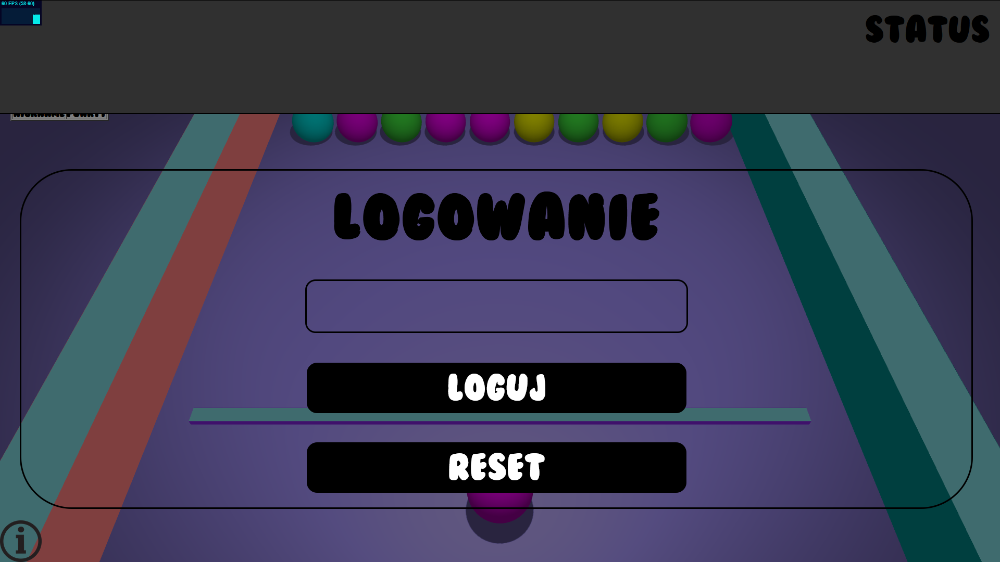
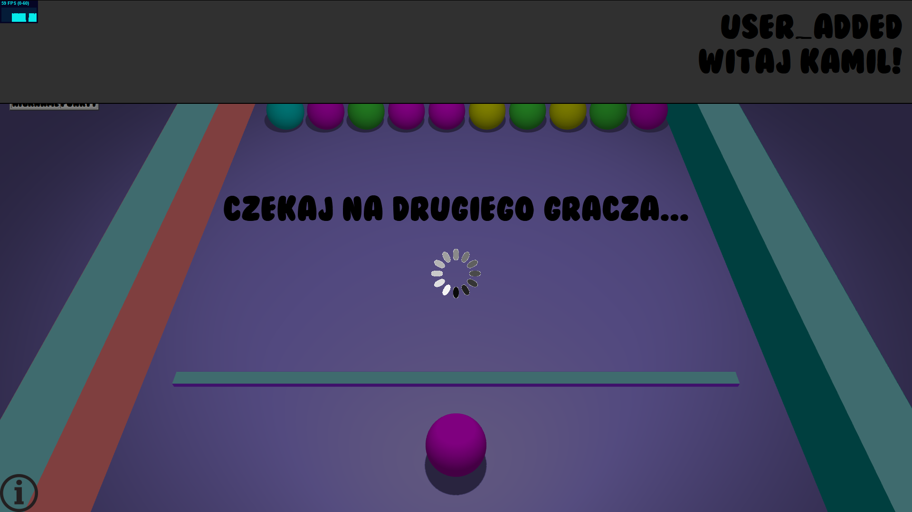
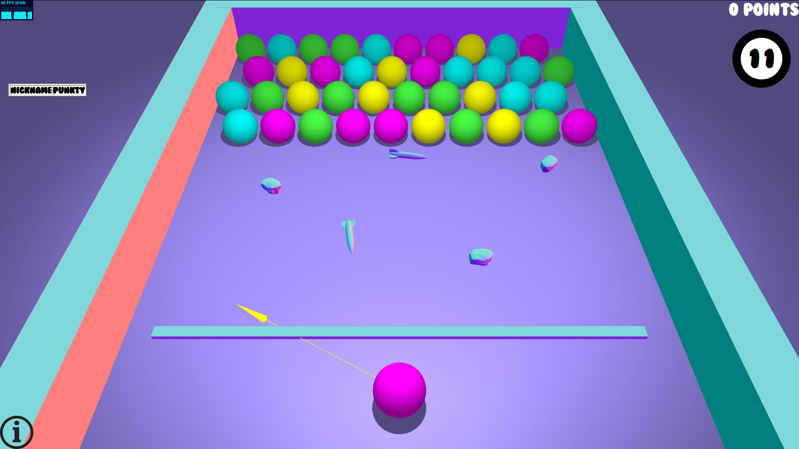
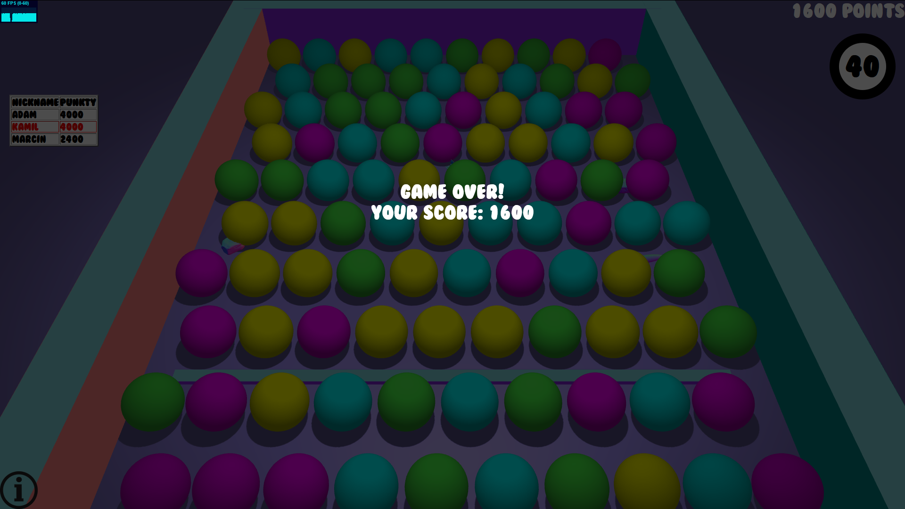

# Marbles
Opis:
Gra polegająca na zbijaniu kulek o odpowiednich kolorach.

## Czego się nauczyłem?
Nauczyłem się tworzyć prostą grę logiczną.

### Wykorzystane technologie:
HTML, CSS, JavaScript, jQuery, Node.js, Three.js, Socket.IO, MongoDB

#### Uruchomienie:
Jeśli nie posiadamy odpowiedniej wersji Mongo, należy ją pobrać z linku: 
#### https://mega.nz/file/ZrgFVbCQ#skjnsyVctqPh_HHV5Lj_nWYUQjccQ9hhzg-CyQJV2IQ
Przejść do folderu mongodb, następnie bin i tam z poziomu konsoli uruchomić:
#### ./mongod --dbpath=..\..\data\db
W osobnej konsoli:
#### ./mongo

Aby uruchomić projekt musimy mieć zainstalowany Node.js.
Po pobraniu otworzyć konsolę w folderze projektu (przytrzymać SHIFT i kliknąć prawym na folder, następnie z menu podręcznego wybrać "Otwórz tutaj okno programu Powershell" lub podobne)).
W okienku konsoli wpisać "node server.js" lub "node .\server.js".
Jeśli polecenie nie działa być może wywoływane jest w folderze, w którym nie ma pliku "server.js".
Jeśli wszystko dobrze zrobiliśmy wyświetli się napis "Listening on 3000...".
Przechodzimy do przeglądarki i w pasku adresu wpisujemy "localhost:3000".
Powinien otworzyć się projekt.

##### Działanie projektu:
Podajemy swoją nazwę gracza i oczekujemy na drugiego.
Otrzymujemy stosowne komunikaty odnośnie graczy w grze.
W osobnej karcie podajemy inną nazwę i wchodzimy do gry.
Gra polega na zdobyciu jak największej ilości punktów.

 
 
 
 

